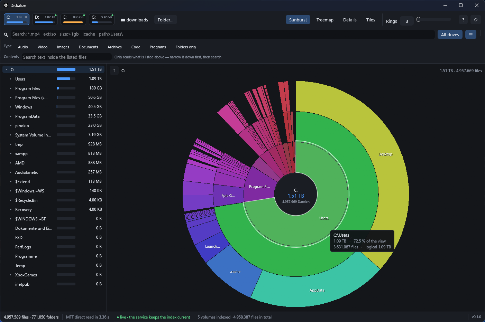
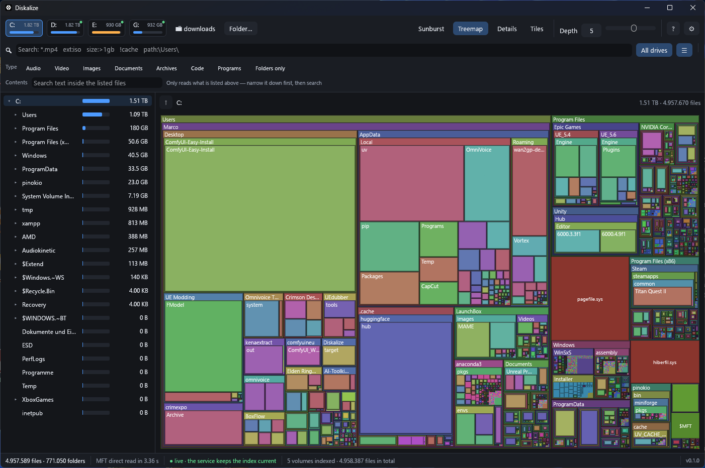
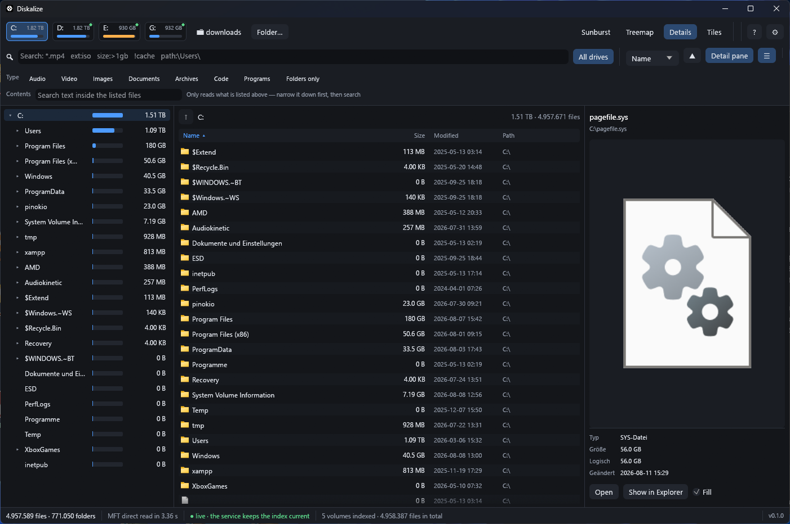
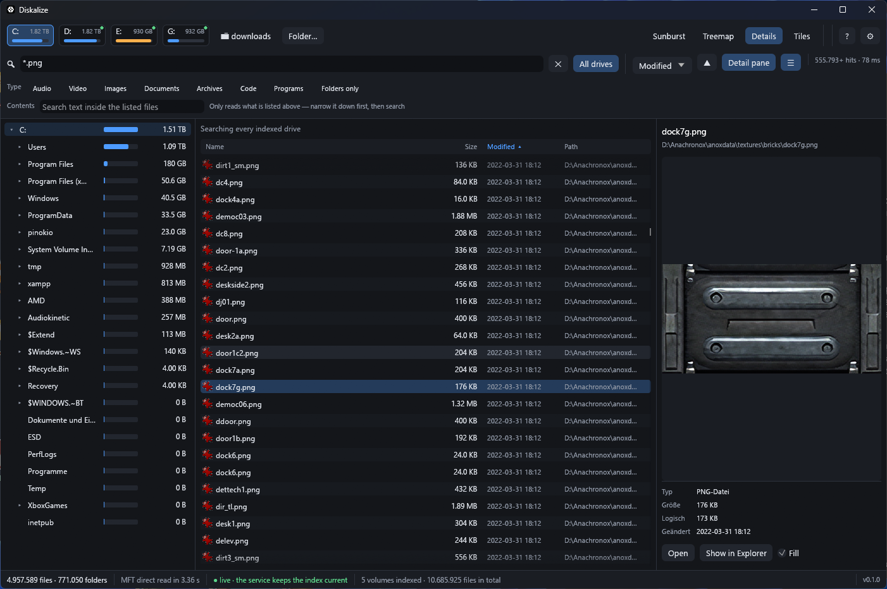

# Diskalize

Disk space analyser for Windows. Reads the NTFS master file table directly, keeps
the index live through the USN journal, and draws everything on the GPU so the
interface never stutters.

**4.96 million files indexed in 3.4 seconds. Searched in 78 ms. The window costs
about 190 MB, and a second one costs 17.**



## Features

**Scanning**
- MFT read straight off the raw volume — no directory walk, no waiting
- USN journal keeps the index current; nothing is ever rescanned
- Every fixed drive indexed in the background, or only the ones you open
- Network shares by UNC path
- Allocated *and* logical size, so compressed and sparse files are honest

**Views**
- Sunburst and treemap, click to zoom in, middle-click or Backspace to go back
- Details list with draggable columns, and a tile view with real thumbnails
- Folder tree with proportional size bars
- Animated transitions throughout

**Search**
- Instant across one drive or all of them
- `*.mp4`, `ext:iso`, `size:>1gb`, `date:>2024-01-01`, `path:\Users\`,
  `is:folder`, `re:^\d{4}_`, `!exclude`
- One-click filters: audio, video, images, documents, archives, code, programs
- **Search inside files** — scoped to a folder or to what the name query
  returned, with the match highlighted in the preview

**Preview**
- Images, video and audio (through libVLC if installed)
- PDF first pages, rendered by Windows itself — no reader required
- Syntax colouring for code and markup
- `.nfo` and `.diz` art in its original code page 437, in a terminal font

**The rest**
- Tiny memory footprint: the index lives once in shared memory, so extra windows
  cost almost nothing and the service holds only 14 MB privately
- Several windows in one process
- Explorer context menu on folders, drives and network locations
- Global hotkey, notification-area icon, autostart straight into the tray
- German and English, extensible with a text file

## Screenshots

| | |
|---|---|
|  |  |
| **Treemap** — every file a rectangle, nested by folder | **Details** — sortable, resizable columns |
|  |  |
| **Search** — 555.793 hits across five volumes in 78 ms | **Tiles** — shell thumbnails, fading in as they arrive |
|  | |
| **Preview** — video playback in the detail pane | |

## Memory

The index is written once by the service into shared memory; every window maps
the same pages read-only. Measured on a 4.96 M file index across five volumes:

| | Working set | Private |
|---|---|---|
| Service | 1129 MB | **14 MB** |
| First window | 190 MB | 404 MB |
| Each further window | **+17 MB** | +30 MB |
| Waiting in the tray | **12 MB** | — |

## Build and install

```bash
cargo build --release
```

Indexing runs in a Windows service, because reading a raw volume needs
LocalSystem — elevation alone is not enough on every drive. Installing it is the
only time admin rights are needed:

```bash
target\release\diskalize-service.exe --install
```

The interface offers to do this on first start. Afterwards `diskalize.exe` runs
with no elevation at all.

## Notes

- Settings live in `%APPDATA%\Diskalize\settings.txt`.
- Language files are read from `lang/` next to the executable. Copy
  `lang/_template.lang`, fill in the right-hand side, and it appears in the
  settings; anything left blank stays German.
- Network shares are walked by the interface rather than the service, which as
  LocalSystem has no credentials for them.

## Licence

MIT. See [LICENSE](LICENSE).

Idea and realisation: Ize.
